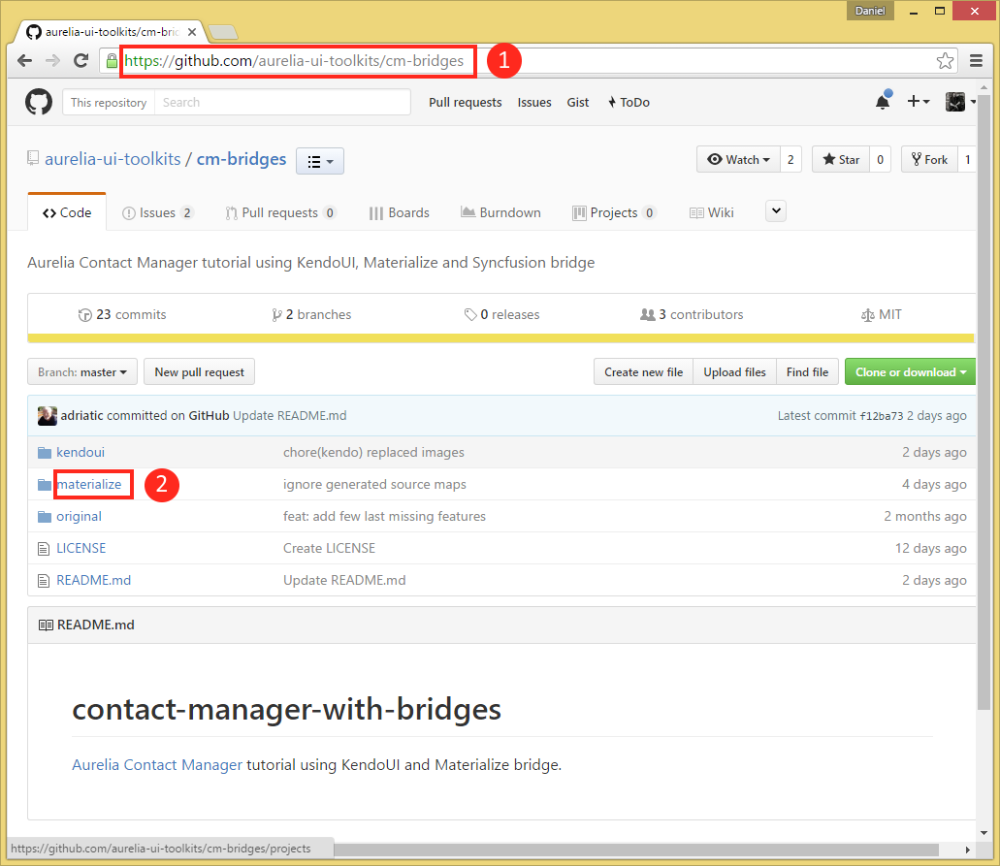

_Creating new application_ | _GitHub_
# CM tutorial - Materialize edition

This application is the full implementation of Aurelia's [Contact Manager Tutorial](http://aurelia.io/hub.html#/doc/article/aurelia/framework/latest/contact-manager-tutorial) used as the teaching tool for a new [web or SPA developer](http://aurelia.io/hub.html#/doc/persona/new-developer), further augmented by rendering its User interface using [Aurelia Materialize bridge](https://github.com/aurelia-ui-toolkits/aurelia-materialize-bridge) based Aurelia Visual Components.

The process starts with the definition of the location where the application will be persisted (Image 1). Note the red "number-markers" which indicate the sequence of mouse click needed to invoke the Files Explorer, select the folder and move to the wizard's next step.

 

  </img>
   
Image 1

 

This template is persisted in GitHub (note that this approach can result with a huge number of templates) with very easy access as the next screen-shot (Image 2) shows: you simply copy the repository URL (https://github.com/aurelia-ui-toolkits/cm-bridges) into clipboard and then paste it in the `GitHub URL` field as shown on Image 3.

 

Image 2

 

Observe that Monterey "understands" the structure of the repository with the template we want to use and offers you to select a folder where the template "lives" (`kendoui` in this case), as shown on Image 3, marker 2.

Image 3

 

Click on the `Next` button on Image 3, marker 3, Monterey prompts for the name of the application to be created (Image 4), using the chosen folder name as the placeholder. In this situation, we should accept this name.

 

Image 4

 

Click on the `Next` button results with the project's configuration  view (Image 5)

  </img>
   
Image 5

 

We are at the very important point in the "conversation" with the Monterey wizard, because the click on the `Next` button (marker 1 on Image 5) will result with Monterey's **workflow form** (Image 6). While at this time, this form is a simple listview enumerating the steps needed to build this app, this will eventually become a real, user programmable workflow - one of Monterey's most attractive features.

Another important point: Monterey is fully capable to detect the "type" of each project - in this case, it recognized that this project is created by Aurelia-CLI and will **automatically create the content of this workflow form**.

In this specific case, please accept all options, ensuring that the build process will start as soon as you click on the `Next` button (marker 1 on Image 6)

  </img>
   
Image 6

 

The build process started and invoked Monterey **Task Manager** which will show the progress of this build (note that the subsequent tasks `fetch tasks` and `au run --watch` are scheduled for the execution next (Image 7, down-facing arrow).

Note also the enabled check-box regulating the behavior of the embedded console, which provides the detailed information of the build process.

 

  </img>
   
Image 7

 

At this point, the reasonable next step would be to **close** Task manager view (Image 7) resulting with the "main view" (Image 8)

  </img>
   
Image 8

 

Monterey is also able to find out the running application's URL - meaning that you just have to click on the `Chrome tile` (Image 8, marker 1) in order to see the application running (Image 9)

Image 9

 

Finally, open the Task Manager view again (Image 11) and use the context menu based `End task` command to terminate the `au run --watch` process.

  </img>
   
Image 11

***
***

